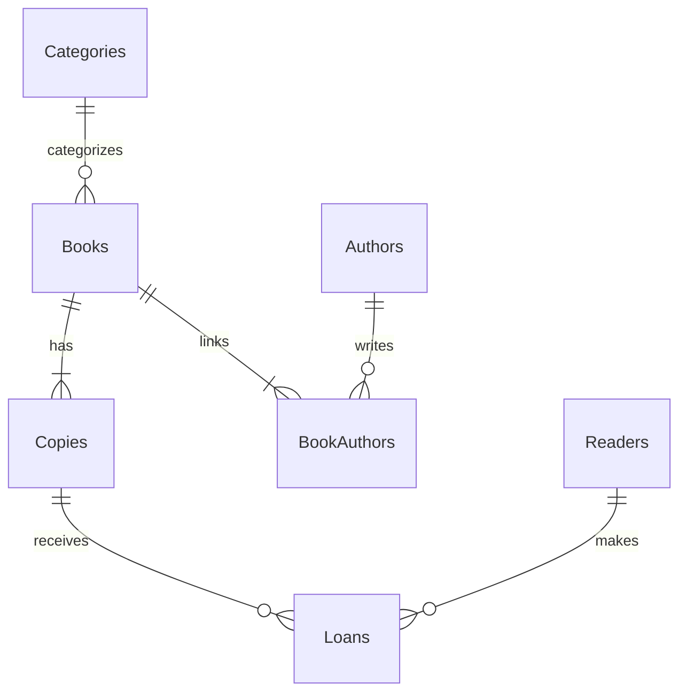

# DER

```mermaid
erDiagram
 Categories ||--o{ Books : categorizes
 Books ||--|{ Copies : has
 Books ||--|{ BookAuthors : links
 Authors ||--o{ BookAuthors : writes
 Readers ||--o{ Loans : makes
 Copies ||--o{ Loans : receives
```

`BookAuthors` resolve Books–Authors (N:N). `Loans` mantém histórico; ativo significa `ReturnedAt IS NULL`.
